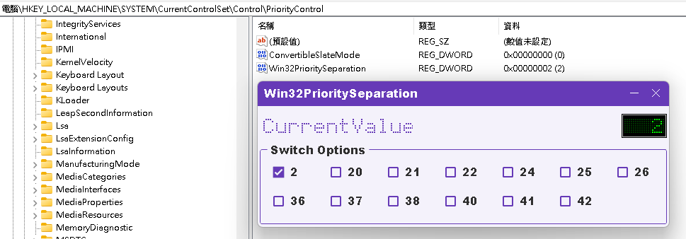

# Win32PrioritySeparation Tool

It's' a tool to quickly adjust Win32 Priority Separation Registry Key On Windows.

According to the input lag discussion on the [Thread](https://forums.blurbusters.com/viewtopic.php?t=8535) On Blur Busters forum.

This tool can be easily adjusted.

## Download

Current Release: [v1.0.0](https://github.com/keoy7am/Win32PrioritySeparationTool/releases/download/v1.0.0/Win32PrioritySeparationTool_1.0.0.zip)

## Usage

Just choose which option you prefer.  
ref: [https://forums.guru3d.com/threads/faq-of-the-software-operating-systems-section.155424/#post-1451631](https://forums.guru3d.com/threads/faq-of-the-software-operating-systems-section.155424/#post-1451631)

| **Decimal** | **Hex** | **Description**                     |
| ----------------- | ------------- | ----------------------------------------- |
| 2                 | 2             | Windows Default.                          |
| 20                | 14            | Long, Variable, No foreground boost.      |
| 21                | 15            | Long, Variable, Medium foreground boost.  |
| 22                | 16            | Long, Variable, High foreground boost.    |
| 24                | 18            | Long, Fixed, No foreground boost.         |
| 25                | 19            | Long, Fixed, Medium foreground boost.     |
| 26                | 1A            | Long, Fixed, High foreground boost.       |
| 36                | 24            | Short, Variable, No foreground boost.     |
| 37                | 25            | Short, Variable, Medium foreground boost. |
| 38                | 26            | Short, Variable, High foreground boost.   |
| 40                | 28            | Short, Fixed, No foreground boost.        |
| 41                | 29            | Short, Fixed, Medium foreground boost.    |
| 42                | 2A            | Short, Fixed, High foreground boost.      |
